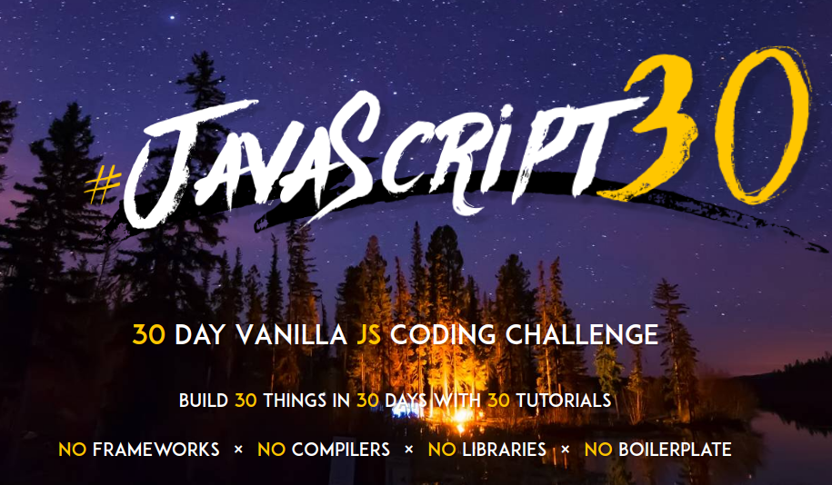

## Javascript 30 Day Challenge

Repository from the projects built following guidances of [Javascript 30](https://javascript30.com) by [Wes Bos](https://wesbos.com/).

### Projects

- [01 - Drum Kit](https://github.com/georgekaran/javascript_30_challenge/tree/master/01_drum-kit)
- [02 - JS Clock](https://github.com/georgekaran/javascript_30_challenge/tree/master/02_js_clock)
- [03 - CSS Variables](https://github.com/georgekaran/javascript_30_challenge/tree/master/03_css_variables)
- [04 - Array Cardio Day 1](https://github.com/georgekaran/javascript_30_challenge/tree/master/04_array_cardio_day_1)
- [05 - Flex Panel Galley](https://github.com/georgekaran/javascript_30_challenge/tree/master/05_flex_panel_gallery)
- [06 - Type Ahead](https://github.com/georgekaran/javascript_30_challenge/tree/master/06_type_ahead)
- [07 - Array Cardio Day 2](https://github.com/georgekaran/javascript_30_challenge/tree/master/07_array_cardio_day_2)
- [08 - Fun with HTML5 Canvas](https://github.com/georgekaran/javascript_30_challenge/tree/master/08_fun_with_html5_canvas)